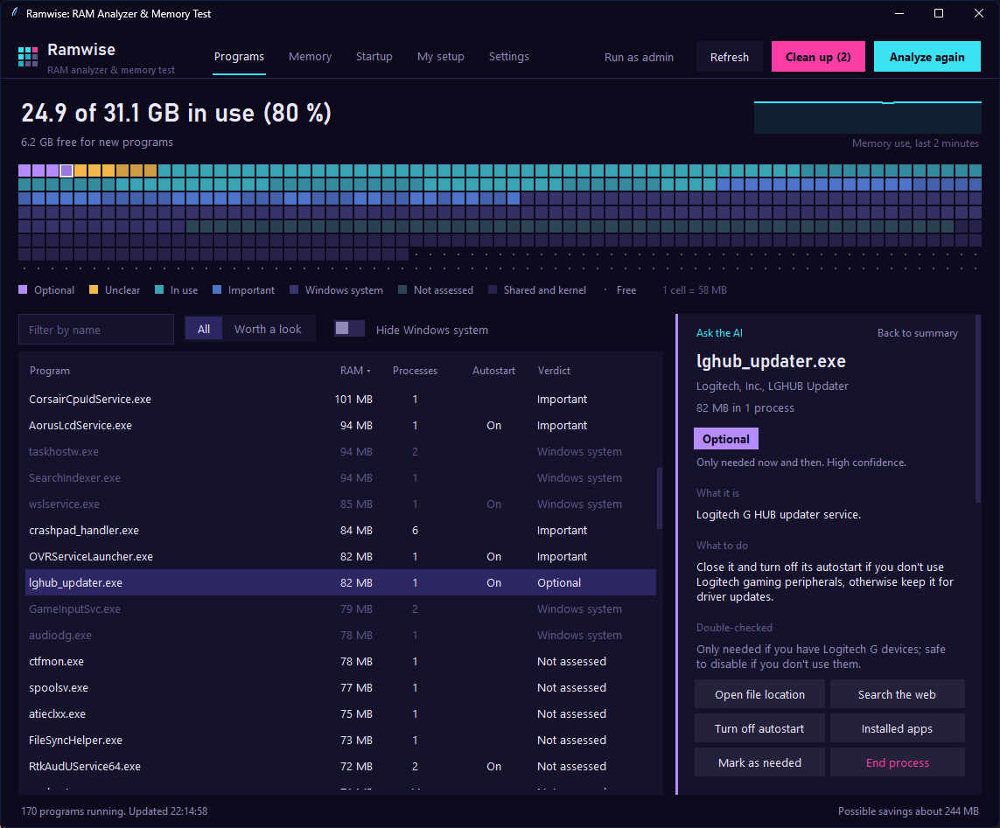

<p align="center">
  
</p>

<h1 align="center">RAMCheck</h1>

<p align="center">
  <b>Find out what's really using your RAM, test it for errors, and get rid of the junk. Safely.</b><br>
  A free, open source Windows app that explains every running program, checks your memory and helps you clean up.
</p>

<p align="center">
  <a href="../../releases/latest"></a>
  <a href="../../releases"></a>
  
  <a href="LICENSE"></a>
</p>

<p align="center">
  <a href="https://github.com/Comroboter/RAMCheck/releases/latest/download/RAMCheck-Setup.exe"><b>Download for Windows</b></a>
  &nbsp;|&nbsp; <a href="#is-it-safe">Is it safe?</a>
  &nbsp;|&nbsp; <a href="#which-ai">Which AI</a>
  &nbsp;|&nbsp; <a href="#faq">FAQ</a>
</p>



Task Manager tells you *how much* memory a program uses. It doesn't tell you *what it is*, whether you need it, or why it starts with Windows. RAMCheck does: it measures everything, lets an AI give each program a verdict with a plain explanation, and then helps you close the junk and stop it from coming back. It also looks at the RAM itself: which modules you have, whether they run at the speed you paid for, and whether they make errors.

## What it does

- **Memory map.** Your whole RAM as a grid of cells, coloured by verdict. You see at a glance how much of it is junk.
- **A verdict for every program.** Bloatware, optional, unclear, in use, important or Windows system, with what it is, what to do about it, and how sure the AI is.
- **Ask the AI.** Click a program and ask anything: "Is it safe to close?", "Why does this start with Windows?", "How do I remove it for good?"
- **Clean up in one go.** Close what you pick and stop it from starting with Windows. RAMCheck shows how much RAM that freed.
- **Startup tab.** Every startup app and third-party service, with the AI's verdict next to it. Everything you turn off can be turned back on.
- **Your setup counts.** Tell RAMCheck what you use (fan control, VR, your headset software) and it won't flag it. Or mark any program as needed.
- **Presets with a price tag.** Quick, Balanced or Thorough, with a time and cost estimate for the exact model you picked.

**Memory tab**

- **Your RAM at a glance.** Every module with slot, size, type, speed, maker and part number.
- **Speed check.** Warns when your RAM runs slower than it's sold as, which usually means XMP or EXPO is off in the BIOS. Also flags single channel setups and mixed kits.
- **RAM error test.** Fills free memory with test patterns (fixed bits, walking ones, random data, address stamps, bit fade) on several threads and reports every byte that comes back wrong.
- **Full test outside Windows.** Schedules Windows Memory Diagnostic with one click and shows the result of its last run.
- **Where your memory goes.** Committed memory, page file, kernel memory and hardware reserved RAM.
- **Leak watch.** Spots programs whose memory keeps climbing while RAMCheck is open.

## Is it safe?

Tools that "clean up your PC" have a bad reputation, often for good reason. RAMCheck is built the other way round:

- **It never acts on its own.** Nothing is closed, changed or uninstalled unless you click the button for it. There's always a confirmation first.
- **Everything is reversible.** Autostart is turned off the same way Task Manager does it and shows up there as "Disabled". Services are set to manual, not deleted.
- **Windows is protected.** Real Windows components are verified by name and folder and can't be flagged, no matter what the AI says. A Windows name in the wrong folder is reported as suspicious instead.
- **No background activity.** RAMCheck doesn't install a service, doesn't start with Windows and pauses measuring while minimized.
- **No telemetry.** The only connections it makes: to the AI you chose, to GitHub's public release page to check for updates (can be turned off), and to OpenRouter's public price list for cost estimates. Nothing about you is sent with the last two. Details in the [privacy policy](PRIVACY.md).
- **Open source, built in public.** The release files are built by [GitHub Actions](.github/workflows/release.yml) straight from this code, not on someone's PC. You can verify that yourself, see [Verify your download](#verify-your-download).

**Why does Windows warn me?** SmartScreen warns about every new program that isn't signed with a paid code signing certificate. Click "More info" > "Run anyway". Some virus scanners also react to apps packaged with PyInstaller (the tool that turns Python into an .exe) even when they're harmless. If you want to be sure, upload the file to [VirusTotal](https://www.virustotal.com), check it as described below, or run RAMCheck from source.

## Download

Get the files from the [latest release](../../releases/latest):

| File | For |
|---|---|
| [`RAMCheck-Setup.exe`](https://github.com/Comroboter/RAMCheck/releases/latest/download/RAMCheck-Setup.exe) | Installing it: Start menu entry, optional desktop icon, uninstall via Installed apps. No admin rights needed. |
| [`RAMCheck-Portable.exe`](https://github.com/Comroboter/RAMCheck/releases/latest/download/RAMCheck-Portable.exe) | Running it without installing anything. |
| [`RAMCheck-cli.exe`](https://github.com/Comroboter/RAMCheck/releases/latest/download/RAMCheck-cli.exe) | The same analysis as text in a terminal. |

Settings live in `%APPDATA%\RAMCheck`. The uninstaller asks whether to delete them too.

### Verify your download

Every release has a `SHA256SUMS.txt`. In PowerShell:

```
Get-FileHash .\RAMCheck-Setup.exe
```

The hash must match the one in the file. With the [GitHub CLI](https://cli.github.com) you can also check that the file was built by this repository's workflow:

```
gh attestation verify .\RAMCheck-Setup.exe -R Comroboter/RAMCheck
```

## Which AI

Pick one in Settings. Every service has a "Load models" button, and RAMCheck shows a cost estimate for the model you choose.

**In the cloud** (your own API key, billed per use by the provider):

| Service | Notes |
|---|---|
| Claude (Anthropic) | Default. With Haiku, a Balanced analysis costs roughly 2 to 3 US cents. |
| OpenAI | |
| Google Gemini | Google AI Studio has a free tier with rate limits. |
| OpenRouter | One key for models from many companies. |
| Mistral | European provider. |
| Other | Any OpenAI-compatible API, for example Groq or DeepSeek. |

**On your PC** (free, nothing leaves your computer):

| Engine | Notes |
|---|---|
| Ollama | Install [Ollama](https://ollama.com). RAMCheck checks whether it's running and can download a model for you. |
| LM Studio | Install [LM Studio](https://lmstudio.ai), load a model and start its local server. |

Local models are free but less accurate with unusual vendor tools. A 7 to 8 billion parameter model needs about 6 GB of RAM while it works. RAMCheck tells Ollama to unload it right after each analysis.

API keys are encrypted with Windows' own data protection (DPAPI), so only your Windows account on this PC can read them.

## Privacy

What the AI gets: program names, sizes, file paths (with your Windows username removed), publisher and description from the exe files, whether a program has a window, is a service or starts with Windows, and your setup notes. No files, no documents, no browsing data. With Ollama or LM Studio, nothing leaves your PC at all.

## Using it

1. Start RAMCheck and pick your AI in Settings
2. Click **Analyze with AI**
3. Click any program for details, or ask the AI about it
4. Click **Clean up** to close the junk and stop it from starting with Windows

| Keys | Does |
|---|---|
| `F5` | Measure again |
| `Ctrl+Enter` | Analyze with AI |
| `Ctrl+F` | Search |
| `Ctrl+1` to `Ctrl+5` | Switch tabs |
| `Esc` | Back to the summary |
| Right click | Actions for a program or startup entry |

Stopping services and changing autostart for all users needs admin rights. Click "Run as admin" in the app, your analysis is kept.

## FAQ

**Will closing programs make my PC faster?**
Only if your RAM is actually full. Below 70 to 80 % usage, free RAM doesn't make games or apps faster. The real win is getting rid of background tools you never asked for. RAMCheck says so in its summary.

**Is the RAM test as good as MemTest86?**
No, and it says so. A test inside Windows can only check memory Windows isn't using, and it sees virtual addresses, so it can't tell which module is faulty. It's great for a quick check after building a PC or changing XMP/EXPO settings: any error it finds is real. For the complete picture, RAMCheck schedules Windows Memory Diagnostic, which runs before Windows starts, or you can use [MemTest86](https://www.memtest86.com/) from a USB stick. For long overclocking stability tests, dedicated tools like TestMem5 or Karhu are made for exactly that.

**Can the AI be wrong?**
Yes. That's why there's a second, stricter check for every bloatware verdict, fixed rules for Windows components, your setup notes, and nothing happens without your click. Look a program up before you uninstall it (there's a button for that).

**A program keeps coming back after I close it.**
Something else starts it, often the vendor's main app or a scheduled task. RAMCheck doesn't touch scheduled tasks. Uninstalling the program is the permanent fix.

**Does RAMCheck cost anything?**
RAMCheck is free. Cloud AI services bill you directly for what you use, usually a few cents per analysis. Local AI is free.

**Something broke.**
Settings > Help > "Report a problem". Attach `%APPDATA%\RAMCheck\error.log` if there is one, it contains no API keys.

## Run or build from source

Python 3.10 or newer:

```
pip install psutil
python ram_check.py          window app
python cli.py --help         terminal version
```

`build.bat` builds the installer, the portable exe, the terminal version and the checksums. The version number comes from `VERSION` in `core.py`. For the installer you also need [Inno Setup 6](https://jrsoftware.org/isinfo.php) (`winget install JRSoftware.InnoSetup`).

| File | What it does |
|---|---|
| `ram_check.py` | Start file, opens the window app |
| `gui.py` | The window app |
| `cli.py` | The terminal version |
| `core.py` | Measuring, settings, the AI part and the safety rules |
| `winsys.py` | Windows specifics: autostart entries, services, file publisher info |
| `memtest.py` | The RAM error test |
| `hardware.py` | RAM modules, memory details, Windows Memory Diagnostic |
| `build.bat`, `installer.iss`, `tools/` | Building the release files |
| `packaging/` | Microsoft Store package and listing |

How to publish a new version: [UPDATING.md](UPDATING.md). Privacy: [PRIVACY.md](PRIVACY.md).

## License

[MIT](LICENSE). Use it, change it, share it.
